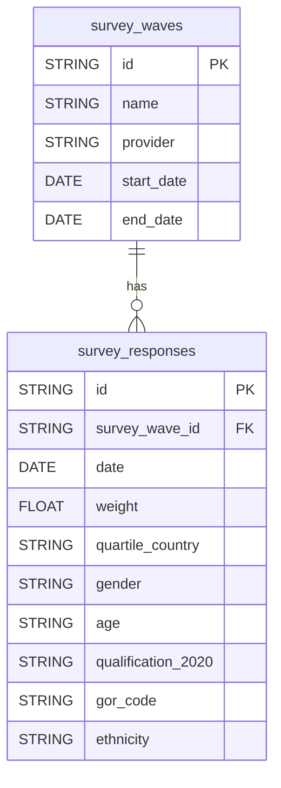

# GOV.UK Polling Dataform

The dataform configuration for modelling GOV.UK polling data. The output tables are made available in BigQuery and Looker.

## Nomenclature

TBC

## Technical documentation

### Data Model

### Running the test suite

TBC

## Licence

[LICENCE](LICENSE)
