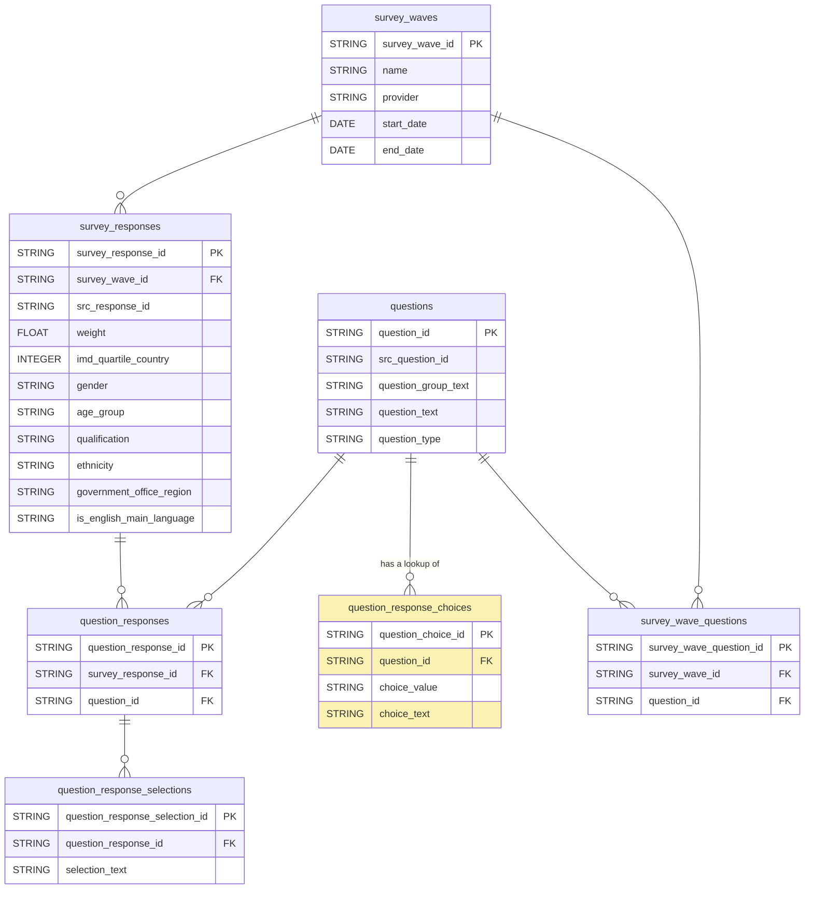

# GOV.UK Polling Dataform

The dataform configuration for modelling GOV.UK polling data. The [dataform pipeline](https://console.cloud.google.com/bigquery/dataform/locations/europe-west2/repositories/polling/details/workspaces?hl=en&inv=1&invt=Ab5YPA&project=gds-bq-reporting) is in the `gds-bq-reporting` GCP project and is called `polling`.
The output tables are made available in [BigQuery dataset](https://console.cloud.google.com/bigquery?hl=en&inv=1&invt=Ab5WvQ&project=govuk-polling&ws=!1m4!1m3!3m2!1sgovuk-polling!2sgovuk_polling_responses!1m10!1m4!4m3!1sgovuk-polling!2sgovuk_polling_responses!3ssrc_bmg_wave_11!1m4!4m3!1sgovuk-polling!2sgovuk_polling_responses!3ssrc_bmg_wave_13) `govuk-polling.govuk_polling_responses` and various [Looker Explores](https://github.com/alphagov/gds-looker/blob/faf1f66e7d424620557d1c55ee1301f709b98873/models/govuk.model.lkml#L58).

## Nomenclature

TBC

## Technical documentation

### Data Model

### Development

#### Creating a Development Workspace
**Note that all BigQuery datasets created by your Development Workspace will have to be deleted manually once you are finished with them.**
All datasets created by your Development Workspace will be suffixed with the workspace name.
For example, if your workspace is called `add_wave_15`, then the following datasets will require manual deletion.
- `govuk-polling.govuk_polling_responses_add_wave_15`
- `gds-bq-reporting.polling_processing_add_wave_15`
- `gds-bq-reporting.dataform_assertions_add_wave_15`
 

#### Adding a new Wave
1. Create a new row in `definitions/lookups/lookup_survey_waves.sqlx`.
2. Upload the source CSV to the `govuk_polling_responses` dataset with the name `src_{provider}_wave_{number}`. For example, `src_bmg_wave_13`.
3. For each question, add a new row in the `definitions/lookups/lookup_survey_wave_questions.sqlx` file including the `wave_name` and `src_question_id`.
    If this wave has the same questions as previous waves, just copy and paste being sure to update the values in `wave_name`.
4. (Optional) You can also generate the {wave_name, src_question_id} tupples using definitions/config/retrieve_columns_from_base.sqlx
5. Execute `definitions/config/query_actual_column_names.sqlx` and copy the output. Then open `includes/constants.js` and paste in the copied string to update the variable const `allSrcColumns`.
6. Execute the workflow to ensure `survey_wave_questions` is populated as expected and no tests fail.

#### Adding a new Question
1. Create a new row in `definitions/lookups/lookup_questions.sqlx`.
2. Create a new row in `definitions/lookups/lookup_question_response_choices.sqlx` using the corresponding `src_question_id`.
You'll need to know the name of the column in the source data which contains the values along with the coded values and the associated selection text.
3. Execute the workflow and inspect the output of the `question_response_choices` table in BigQuery.

### Deployment
Once you PR is reviewed and approved, merge into `main`.

The production release configuration is based on `main` and will compile once a day. To manually compile, go to [Release Configurations](https://console.cloud.google.com/bigquery/dataform/locations/europe-west2/repositories/polling/details/release-scheduling?hl=en&inv=1&invt=Ab1Ofw&project=gds-bq-reporting).
Then select the `production` configuration and select `New compliation` which will sync to the latest changes on `main` branch. Then, go back to the "Releases & Scheduling" section and choose `Start Execution`.

### Scripts

This includes a script used to clean files locally and then upload them to BigQuery (BQ). Place your .csv file in the Python folder; the script will process it and output the result into python/simple_processed, after which it will be uploaded to BQ.

#### Upload BMG wave data
The script `bmg_polling_data_processor.py` can be used to upload data to BigQuery. Ideally this would be automated. You will need Python>=3.12 installed on your local machine.

### Install
1. Create a virtual enviroment to install the dependencies using `python -m venv .venv`.
2. Activate the environment `source .venv/bin/activate`.
3. Change into the `scripts` directory - `cd scripts`
3. Install the dependencies `pip install -r requirements.txt`.

#### Prepare the CSV
You will need to download the `export` sheet of the spreadsheet as a CSV file yo your local machine. 

#### Run
The script `bmg_polling_data_processor.py` has been useful while we've been iterating but will need some work to productionise. However, you can change values in the Configuration and Setup section to upload a file. Documenting these values here will likely drift for now so use the python file directly for now.

## Licence

[LICENCE](LICENSE)
