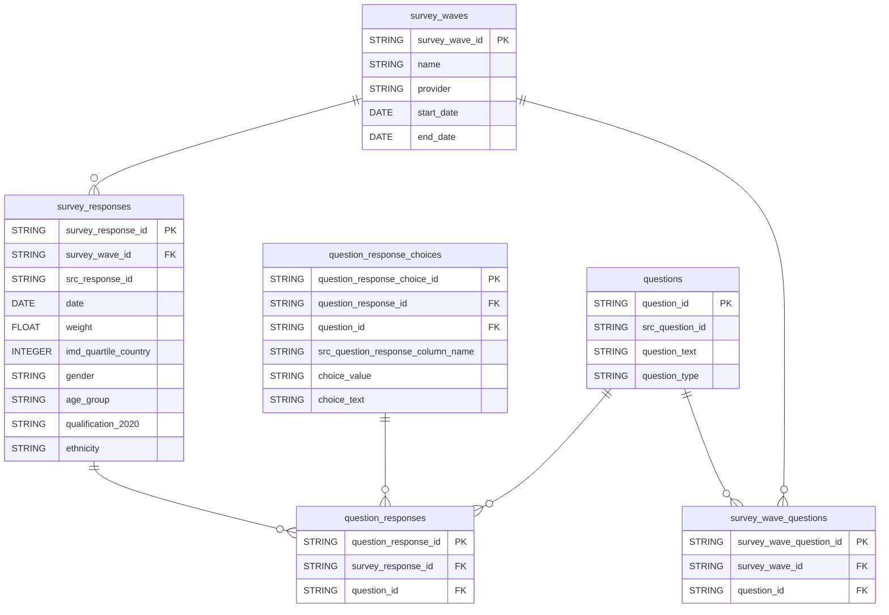

# GOV.UK Polling Dataform

The dataform configuration for modelling GOV.UK polling data. The output tables are made available in BigQuery and Looker.

## Nomenclature

TBC

## Technical documentation

### Data Model

### Development

#### Adding a new Wave
1. Create a new row in `definitions/lookups/lookup_survey_waves.sqlx`.
2. Execute the workflow so that the BigQuery table `survey_waves` generates an ID for that row.
Query that table and copy the `survey_wave_id`.
3. Query the `questions` table in BigQuery and identify all questions that are included in the wave.
4. For each question,
    add a new row in the `definitions/lookups/lookup_survey_wave_questions.sqlx` file including the `survey_wave_id` noted earlier and the `question_id`.
5. Execute the workflow to ensure `survey_wave_questions` is populated as expected.

#### Adding a new Question
1. Create a new row in `definitions/lookups/lookup_questions.sqlx`.
2. Execute the workflow to populate the `questions` table. Then query it and make a note of the `question_id`.
3. Create a new row in `definitions/lookups/lookup_question_response_choices.sqlx` using the `question_id`.
You'll need to know the name of the column in the source data which contains the values along with the coded values and the associated selection text.
4. Execute the workflow and inspect the output of the `question_response_choices` table in BigQuery.

### Deployment
Once you PR is reviewed and approved, merge into `main`.

The production release configuration is based on `main` and will compile once a day. To manually compile, go to [Release Configurations](https://console.cloud.google.com/bigquery/dataform/locations/europe-west2/repositories/polling/details/release-scheduling?hl=en&inv=1&invt=Ab1Ofw&project=gds-bq-reporting).
Then select the `production` configuration and `Start Execution`.

## Licence

[LICENCE](LICENSE)
