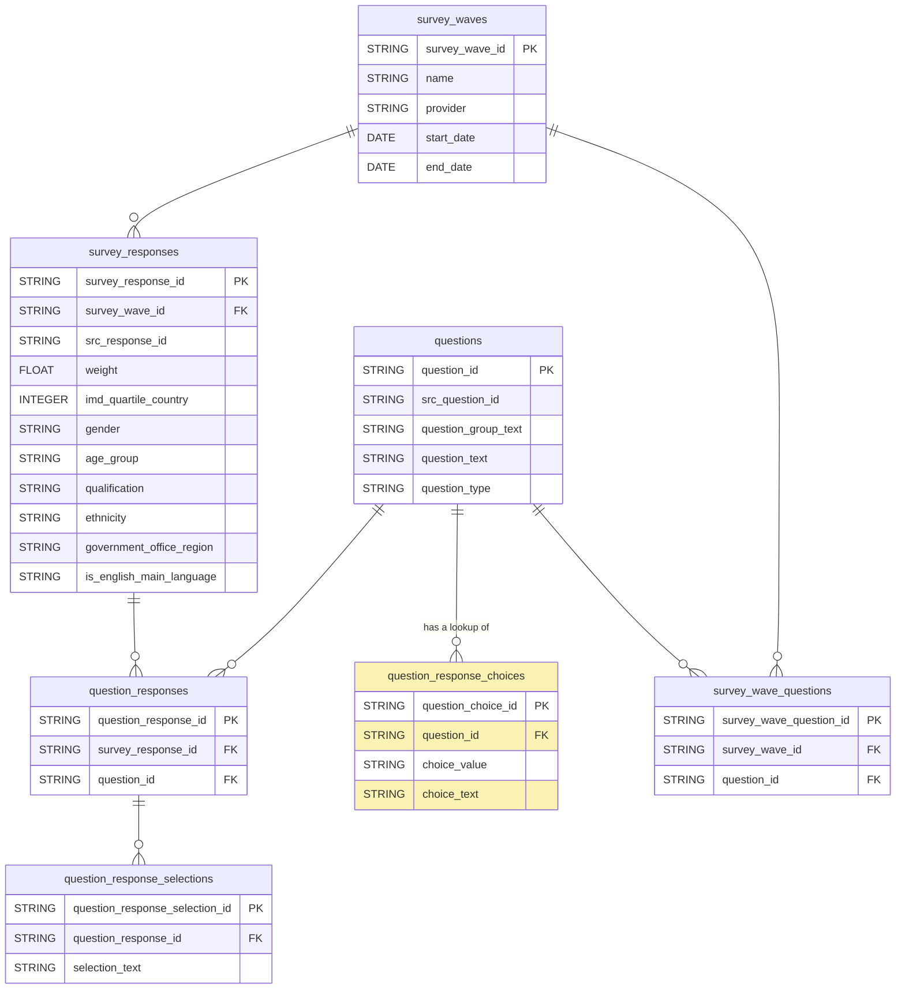

# GOV.UK Polling Dataform

The dataform configuration for modelling GOV.UK polling data. The output tables are made available in BigQuery and Looker.

## Nomenclature

TBC

## Technical documentation

### Data Model

### Development

#### Adding a new Wave
1. Create a new row in `definitions/lookups/lookup_survey_waves.sqlx`.
2. Upload the source CSV to the `govuk_polling_responses` dataset with the name `src_{provider}_wave_{number}`. For example, `src_bmg_wave_13`.
2. For each question, add a new row in the `definitions/lookups/lookup_survey_wave_questions.sqlx` file including the `wave_name` and `src_question_id`.
    If this wave has the same questions as previous waves, just copy and paste being sure to update the values in `wave_name`.
3. Execute the workflow to ensure `survey_wave_questions` is populated as expected.

#### Adding a new Question
1. Create a new row in `definitions/lookups/lookup_questions.sqlx`.
2. Create a new row in `definitions/lookups/lookup_question_response_choices.sqlx` using the corresponding `src_question_id`.
You'll need to know the name of the column in the source data which contains the values along with the coded values and the associated selection text.
3. Execute the workflow and inspect the output of the `question_response_choices` table in BigQuery.
4. Add the column which contains the coded values to the `UNPIVOT` code in `definitions/staging/stg_unpack_question_responses.sqlx`.

### Deployment
Once you PR is reviewed and approved, merge into `main`.

The production release configuration is based on `main` and will compile once a day. To manually compile, go to [Release Configurations](https://console.cloud.google.com/bigquery/dataform/locations/europe-west2/repositories/polling/details/release-scheduling?hl=en&inv=1&invt=Ab1Ofw&project=gds-bq-reporting).
Then select the `production` configuration and select `New compliation` which will sync to the latest changes on `main` branch. Then, go back to the "Releases & Scheduling" section and choose `Start Execution`.

## Licence

[LICENCE](LICENSE)
