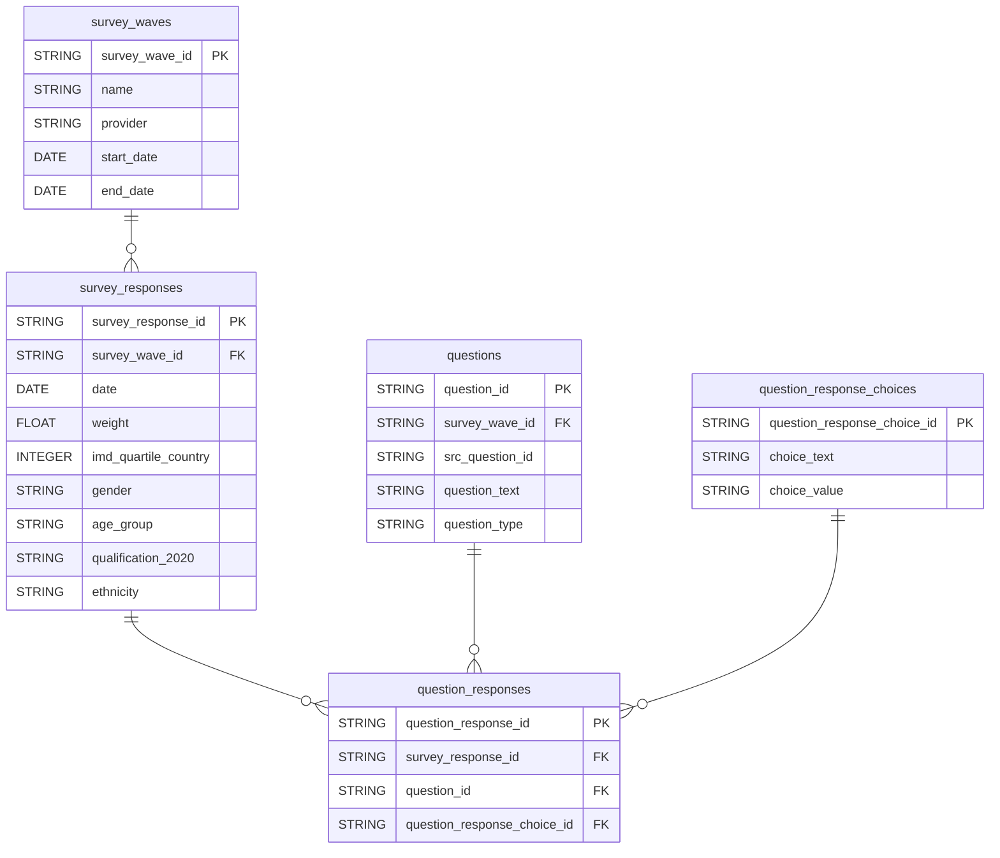

# GOV.UK Polling Dataform

The dataform configuration for modelling GOV.UK polling data. The output tables are made available in BigQuery and Looker.

## Nomenclature

TBC

## Technical documentation

### Data Model

### Development

TBC

### Deployment
Once you PR is reviewed and approved, merge into `main`.

The production release configuration is based on `main` and will compile once a day. To manually compile, go to [Release Configurations](https://console.cloud.google.com/bigquery/dataform/locations/europe-west2/repositories/polling/details/release-scheduling?hl=en&inv=1&invt=Ab1Ofw&project=gds-bq-reporting).
Then select the `production` configuration and `Start Execution`.

## Licence

[LICENCE](LICENSE)
